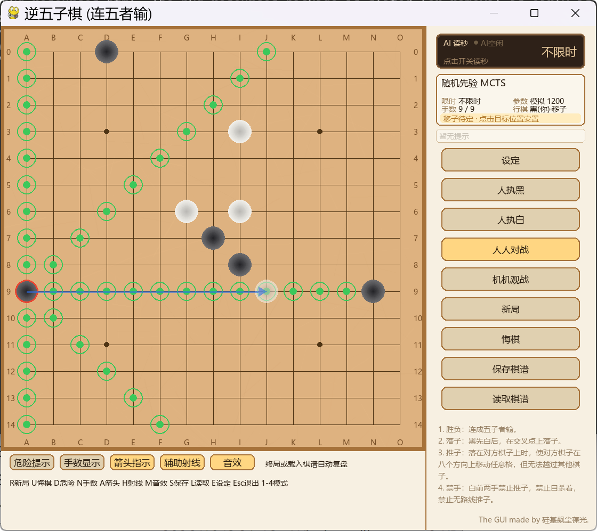

# Antifive — Inverse Gomoku AI GUI

[中文](README.md)



**Antifive** is an open-source project for **Inverse Gomoku** (Chinese: 逆五子棋;
the player who first makes five in a row *loses*). It ships:

- a pygame GUI (human vs human / AI vs AI, review & branch replay, hints, clocks,
  synthesized sounds, `.afg` record save/load);
- a pure-numpy rules engine (plus a batched GPU mirror for training);
- four engines: uniform-prior MCTS, a self-trained policy/value network
  (**training failed**, kept for reproduction), a heuristic alpha-beta AI, and a
  KataGo integration with self-trained inverse-gomoku weights;
- an AlphaZero-style training pipeline (negative result, kept for study);
- weights: `.pth` for the failed self-trained net and `.bin` for KataGo.

> ## AI Usage Statement
>
> **Please note** that the code and text content of this project are generated by
> AI, preliminarily reviewed by humans, but still require careful verification of
> accuracy.
>
> > **AI 使用声明:** 本项目代码与文本主体由 AI 生成,经过人工初步核查但仍需要
> > 仔细甄别内容正误。

---

## Table of Contents

- [Rules](#rules)
- [Inverse Gomoku and Its Inventor](#inverse-gomoku-and-its-inventor)
- [Project Status (read first)](#project-status-read-first)
- [Install](#install)
- [Setup Check and One-Click Install](#setup-check-and-one-click-install-recommended)
- [Quick Start](#quick-start)
- [Shortcuts](#shortcuts)
- [Engines and Weights](#engines-and-weights)
- [Record Format](#record-format)
- [Training (negative result)](#training-negative-result)
- [Repository Layout](#repository-layout)
- [Environment and Known Boundaries](#environment-and-known-boundaries)
- [Third-Party and Credits](#third-party-and-credits)
- [License](#license)
- [Contact](#contact)

---

## Rules

15×15 board, Black moves first. Each turn a player either **places** a stone on
an empty cell, or **relocates**: capture an opponent stone, then place it on an
empty cell along one of 8 directions (two steps, one turn). The player who first
makes five in a row **loses**. The balancing rule — White may not relocate
during the first 2 turns — was proposed by
[hzyhhzy](https://github.com/hzyhhzy), the author of KataGo/KataGomo.

> **Naming note**: this project uses the Chinese name 「逆五子棋」 (*Inverse
> Gomoku*) to distinguish it from *reverse gomoku*, which has no relocation
> rule. Both share the same losing condition (five in a row loses); Inverse
> Gomoku adds the capture-and-replace relocation mechanic. Full rules:
> [`docs/rules.md`](docs/rules.md) (Chinese).

## Inverse Gomoku and Its Inventor

Inverse Gomoku was invented by **日出333** (Bilibili):

- Inventor's Bilibili: [space.bilibili.com/484235404](https://space.bilibili.com/484235404)
- Rules intro video: [BV1n84y1G7jT](https://www.bilibili.com/video/BV1n84y1G7jT)
- GUI showcase video: [BV1i1eB6REcr](https://www.bilibili.com/video/BV1i1eB6REcr)

This project is an open-source AI battle and training implementation of the game.

## Project Status (read first)

- **Practical engines are the heuristic AI and KataGo.** The self-trained
  policy/value network (`network.py` + `training/`) **failed overall**: due to
  limited self-play data and compute budget, its strength stays at best slightly
  below the heuristic engine. Its code and weights (`models/warm_model.pth`,
  `models/best_model.pth`) are kept for reproduction and as a negative result;
  see [`docs/training-log.md`](docs/training-log.md) (Chinese).
- KataGo weights (`models/katago/*.bin`) are inverse-gomoku weights self-trained
  on top of [hzyhhzy/KataGomo](https://github.com/hzyhhzy/KataGomo).
  `katago.exe` and CUDA/cuDNN runtime libraries are **not redistributed**
  (license and size); see [`docs/engines.md`](docs/engines.md) (Chinese).
- Developed on Windows / Python 3.13 / torch 2.9.1+cu130 / pygame 2.6.1 /
  numpy 2.2.6 (requires Python ≥ 3.10).

## Install

```bash
git clone https://github.com/guijixzh/Inverse-Gomoku-GUI-vs-AI.git
cd Inverse-Gomoku-GUI-vs-AI

conda create -n antifive python=3.13 -y
conda activate antifive

# GPU (recommended), e.g. CUDA 13.0
pip install torch --index-url https://download.pytorch.org/whl/cu130
# or CPU: pip install torch

pip install -e ".[gui,nn]"
```

Without torch, the GUI / heuristic / KataGo still work; the neural engine is
disabled automatically:

```bash
pip install -e ".[gui]"
```

## Setup Check and One-Click Install (recommended)

The repo ships source, configs, and ready-made weights; third-party binaries
such as `katago.exe` are **not redistributed**. A stdlib-only helper is included:

```bash
python scripts/setup_env.py            # check dependencies and resource files
python scripts/setup_env.py --install  # install missing deps (GPU/CPU aware)
```

`--install` detects an NVIDIA GPU and installs the matching CUDA torch wheel,
otherwise falls back to CPU (`--cpu` forces CPU, `--torch-index URL` overrides
the index). The script also verifies weights/configs and reports whether the
KataGo executable and its DLLs are in place.

### Optional: enable the KataGo engine (shortest path)

1. Build/obtain `katago.exe` with inverse-gomoku rule support (source:
   KataGomo; GPU build additionally needs NVIDIA CUDA/cuDNN, neither is
   redistributed) — see [docs/engines.md](docs/engines.md);
2. Put `katago.exe` and its DLLs into `katago/` (or anywhere);
3. Launch the GUI → Settings → KataGo → use Browse to pick the executable,
   weight and GTP config → Confirm (paths are saved to the gitignored
   `config/engines.local.json` for this machine);
4. Re-run `python scripts/setup_env.py` to verify.

> Note: this repo does **not** include KataGo training programs or their
> dependencies; `models/katago/*.bin` are pre-trained weights, ready to play.

## Quick Start

```bash
python -m antifive                        # GUI (same as the `antifive` script)
python -m antifive --engine heuristic     # heuristic AI (depth 4)
python -m antifive --model models/best_model.pth   # self-trained net as MCTS prior
python -m antifive --engine katago        # KataGo (place katago.exe yourself)
python -m antifive.cli --model models/best_model.pth --sims 400   # console play

pip install -e ".[dev,nn]" && pytest -q   # tests
```

On Windows you can also double-click [`run_gui.bat`](run_gui.bat) in the repo
root (adds `src/` to `PYTHONPATH` and launches the GUI; accepts the same flags).
If the default Python lacks dependencies, run
`python scripts/setup_env.py --install` first; alternatively create
`run_gui.local.bat` (gitignored) containing
`set PY="path\to\your\python.exe"`.

## Shortcuts

| Key | Action |
|---|---|
| R | New game |
| U | Undo |
| D | Danger hints |
| N | Move numbers |
| A | Relocation arrows |
| H | Hover rays |
| M | Sound |
| S / L | Save / load `.afg` record |
| E | Settings panel |
| 1–4 | Human-Black / Human-White / Human-Human / AI-AI |
| ← → | Review back / forward |
| Esc | Quit |

## Engines and Weights

| Engine | Deps | Strength | Notes |
|---|---|---|---|
| Uniform-prior MCTS | numpy | Low | default fallback |
| Self-trained net MCTS | torch + `.pth` | Insufficient (training failed) | research only |
| Heuristic AI | numpy | Medium-high | depth 1–8, default 4 |
| KataGo (inverse gomoku) | external exe + `.bin` | High | recommended |

See [`models/README.md`](models/README.md) and
[`docs/engines.md`](docs/engines.md) (Chinese).

## Record Format

`.afg` is a human-readable UTF-8 text format with rule config, result and moves
(optionally per-move analysis). Samples in `data/samples/`; spec in
[`docs/afg-format.md`](docs/afg-format.md) (Chinese).

## Training (negative result)

```bash
python -m antifive.heuristic --games 1000 --out records
python -m antifive.training.pretrain_bc --records records --out checkpoints/warm_model.pth
python -m antifive.training.train --resume models/warm_model.pth
```

**The training pipeline failed overall** (strength at best slightly below the
heuristic engine). Details and possible causes:
[`docs/training-log.md`](docs/training-log.md) (Chinese).

## Repository Layout

```
Inverse-Gomoku-GUI-vs-AI/
├── src/antifive/            # rules engine, MCTS, network, heuristic, tactics,
│   ├── gui.py cli.py paths.py
│   ├── training/            # self-play and training pipeline
│   └── tools/               # matches, diagnostics, parameter tuning
├── config/                  # engines.json, gtp_test.cfg
├── data/                    # params, eval pool, sample .afg records
├── models/                  # weights (see models/README.md)
├── docs/                    # rules, afg format, engines, training log
├── tests/                   # pytest regression tests
├── packaging/               # PyInstaller build (no-torch)
├── pyproject.toml
└── THIRD_PARTY_NOTICES.md
```

## Environment and Known Boundaries

- Windows 11 only tested; GUI uses Windows Chinese font fallback;
- Python ≥ 3.10 (developed on 3.13);
- torch is optional (GUI/heuristic/KataGo keep working without it);
- `katago.exe` and CUDA/cuDNN are not redistributed;
- the self-trained network failed and is research-only;
- the rules-consistency test needs an external `rules_probe.exe` and is skipped
  otherwise.

## Third-Party and Credits

- [lightvector/KataGo](https://github.com/lightvector/KataGo) — MIT;
- [hzyhhzy/KataGomo](https://github.com/hzyhhzy/KataGomo) — inverse-gomoku rules
  and weight training base;
- [lxsgx23/Ivy-Gomoku](https://github.com/lxsgx23/Ivy-Gomoku) — GPL-3.0 config
  format reference; **no GPL code is included in this repository**;
- NVIDIA CUDA/cuDNN — not redistributed.

See [`THIRD_PARTY_NOTICES.md`](THIRD_PARTY_NOTICES.md).

## License

[MIT](LICENSE)

## Contact

- GitHub: [https://github.com/guijixzh](https://github.com/guijixzh)
- Bilibili: [https://space.bilibili.com/74464185](https://space.bilibili.com/74464185)
- Email: 1722532014@qq.com (preferred) / guijixzh@gmail.com
- QQ: 1722532014
